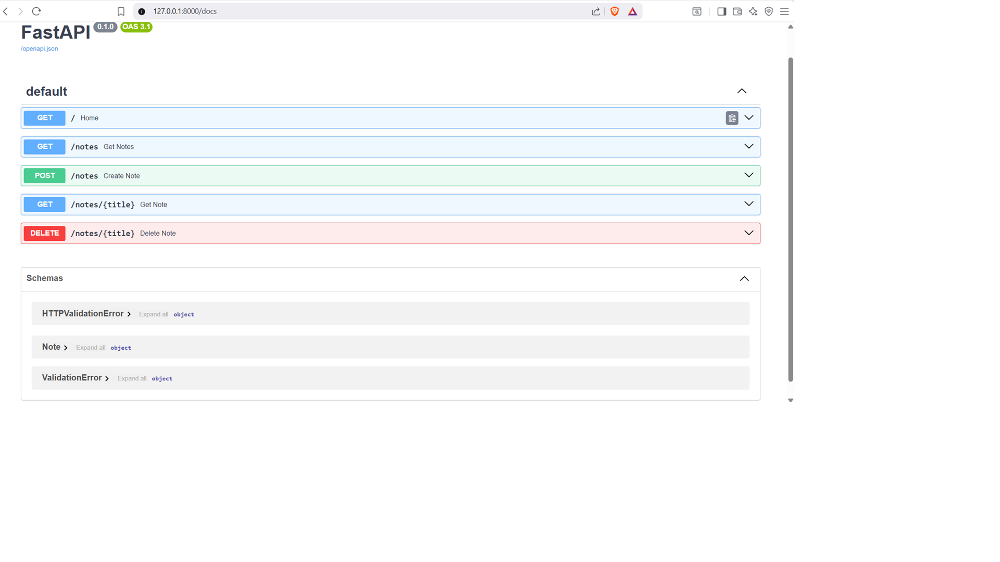

# FastAPI Notebook App

A simple notebook application built using FastAPI.

## Features

- Create notes
- View all notes
- View a specific note
- Delete notes

## Installation

```bash
pip install fastapi uvicorn pydantic
```

## Run

```bash
python -m uvicorn main:app --reload
```

## API Documentation

Open in your browser:

http://127.0.0.1:8000/docs

## Endpoints

| Method | Endpoint | Description |
|----------|----------|----------|
| GET | / | Home |
| POST | /notes | Create a note |
| GET | /notes | Get all notes |
| GET | /notes/{title} | Get a specific note |
| DELETE | /notes/{title} | Delete a note |

## Author

Roshna J

## Swagger UI

